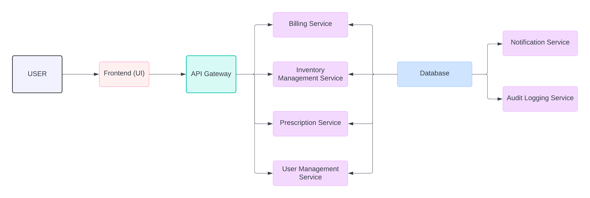

# System Design: EMR Billing & Inventory Management Module

## Overview

This document outlines the system design for an EMR billing and inventory management module, tailored for Ilara Health. The module aims to:

*   Integrate prescription management with real-time inventory tracking.
*   Enable efficient inventory management with upload, update, and removal functionalities.
*   Provide secure, role-based access to different EMR users.
*   Ensure system robustness and minimize downtime.
*   Maintain comprehensive audit logs for transparency and analysis.
*   Facilitate easy integration with Ilara Health's existing EMR system.

## Project Details

*   **Client:** Ilara Health
*   **Author:** Vincent Wachira
*   **Date:** June 8, 2024
*   **Version:** 1.0

## System Architecture

The system is composed of the following core components:

*   **User Management Service:** Handles user authentication, authorization, and role-based access control.
*   **Inventory Management Service:** Manages the inventory of medications, including stock levels, expiration dates, and reorder points.
*   **Prescription Management Service:** Enables doctors to create prescriptions, check inventory levels, and suggest alternative medications based on stock and molecular matches.
*   **Billing Service:** Calculates charges based on prescribed medications and services, generates invoices, and processes payments.
*   **Audit Logging Service:** Records all user actions and system events for traceability and analysis.
*   **Notification Service:** Sends alerts for low stock levels, expiring medications, and other relevant events.
*   **Frontend (UI):** Provides user interfaces tailored for different roles, including doctors, pharmacists, and administrators.
*   **API Gateway:** Acts as a single entry point for all API requests, handling routing, authentication, and rate limiting.

## Data Model

The system utilizes a relational database (PostgreSQL) with the following key entities:

*   **User:** Stores user information (ID, name, role, credentials).
*   **Medication:** Stores medication details (ID, name, generic name, manufacturer, form, strength).
*   **Inventory:** Tracks medication stock (ID, medication\_ID, quantity, batch number, expiry date).
*   **Prescription:** Stores prescription details (ID, patient\_ID, doctor\_ID, medication\_ID, dosage, quantity).
*   **Invoice:** Stores invoice details (ID, patient\_ID, items, total cost, payment status).
*   **AuditLog:** Records user actions and system events (ID, user\_ID, action, timestamp).

## API Design

The system exposes RESTful APIs to facilitate communication between the frontend and backend components.

**Example Endpoints:**

| Endpoint                        | Method | Description                                                                      |
| --------------------------------- | ------ | -------------------------------------------------------------------------------- |
| `/api/users`                    | GET    | Get a list of all users.                                                          |
| `/api/users/{id}`                | GET    | Get details of a specific user.                                                   |
| `/api/users`                    | POST   | Create a new user.                                                               |
| `/api/inventory`                | GET    | Get a list of all inventory items.                                                |
| `/api/inventory/{id}`            | GET    | Get details of a specific inventory item.                                         |
| `/api/inventory/{id}`            | PUT    | Update the quantity of a specific inventory item.                                |
| `/api/prescriptions`            | POST   | Create a new prescription.                                                        |
| `/api/prescriptions/{id}`        | GET    | Get details of a specific prescription.                                          |
| `/api/invoices`                 | GET    | Get a list of all invoices.                                                     |
| `/api/invoices/{id}`             | GET    | Get details of a specific invoice.                                               |

## Scalability & Performance

To ensure the system can handle increasing load and usage, the following scalability and performance strategies will be implemented:

### Horizontal Scaling

*   **Microservices Architecture:** Each core component (Inventory, Prescription, Billing, etc.) is designed as an independent microservice. This allows for scaling individual services independently based on their load requirements. For instance, if the prescription service experiences high traffic, more instances of it can be deployed without affecting other services.
*   **Load Balancing:** A load balancer will be used to distribute incoming requests evenly across multiple instances of each microservice and the API Gateway. This prevents any single instance from becoming overloaded and ensures optimal resource utilization.

### Database Scaling

*   **Read Replicas:**  Read replicas of the PostgreSQL database will be created to handle read-heavy workloads. This offloads read traffic from the primary database, improving query performance and overall system responsiveness.
*   **Sharding (Potential Future Optimization):** If the data volume grows significantly, database sharding can be considered. This involves splitting the database into multiple shards, each responsible for a subset of the data. This can drastically improve scalability for massive datasets.

### Caching

*   **Redis Cache:** Redis will be utilized for caching frequently accessed data, such as medication details, inventory summaries, and user profiles. This reduces the number of database queries, leading to faster response times and reduced database load.

### Cloud Infrastructure (GCP)

*   **Google Kubernetes Engine (GKE):** The system will be deployed on GKE, which provides a managed Kubernetes environment for orchestrating and scaling containerized applications. This allows for easy scaling of individual microservices and efficient resource management.
*   **Cloud Load Balancing:** GCP's Cloud Load Balancing will be used to distribute traffic across multiple instances of the API Gateway and microservices, ensuring high availability and fault tolerance.

## Observability & Performance Monitoring

The system will be instrumented with robust observability and performance monitoring mechanisms:

### Logging

*   **Pino:** Pino will be used as the logging library due to its high performance and structured logging capabilities. Logs will include relevant information like timestamps, log levels, request/response details, and error messages.
*   **Centralized Logging (Google Cloud Logging):** Logs from all services will be aggregated and stored in Google Cloud Logging for centralized analysis and troubleshooting.

### Monitoring

*   **Prometheus:** Prometheus will be used to collect metrics from the API Gateway and microservices. Key metrics will include:
    *   Request latency
    *   Error rates
    *   Throughput (requests per second)
    *   Resource utilization (CPU, memory, disk)
*   **Grafana:** Grafana will be used to visualize the collected metrics, providing dashboards and alerts for monitoring system health and performance.

### Alerting

*   **Alerting Rules:**  Alerting rules will be configured in Prometheus to trigger notifications when critical metrics exceed predefined thresholds (e.g., high error rates, high latency, low disk space).
*   **Notification Channels:** Alerts will be sent through appropriate channels like email, Slack, or PagerDuty to ensure timely response to issues.

## Summary of Decisions & Clarifications

*   **Single API Gateway:** We've opted for a single API Gateway for simplicity in the initial deployment, with the option to introduce separate gateways later if needed.
*   **Technology Stack:** The chosen technologies (Node.js, TypeScript, React, PostgreSQL, Prisma, Zod, Pino) align with Ilara Health's existing infrastructure and expertise, facilitating smoother development and maintenance.
*   **Cloud Provider:** Google Cloud Platform (GCP) was chosen for its scalability, managed services (GKE, Cloud Logging), and free tier offering.
*   **Data Synchronization:** Inventory levels will be updated in real-time using webhooks or a similar mechanism to ensure doctors always have the latest information.
*   **Offline Mode:** Offline functionality will be considered in a future iteration as it requires additional complexity in data synchronization and conflict resolution.
*   **Security & Compliance:**  The system will adhere to HIPAA and GDPR regulations, with measures like encryption of sensitive data, role-based access control, and regular security audits.
*   **Open Questions:**
    *   Need clarification on the exact integration points with Ilara Health's existing EMR system.
    *   Need confirmation on the preferred payment gateway provider for the Billing service.

